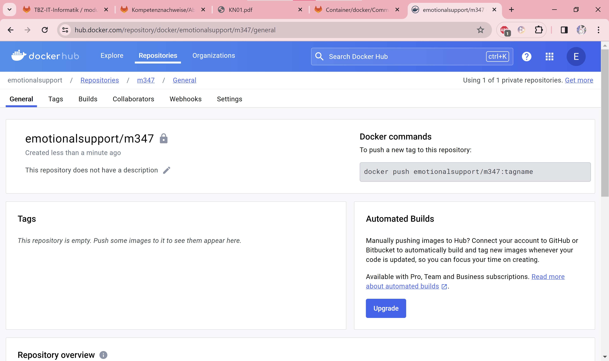

### A

### B

1. docker --version
2. docker search --filter "is-official=true" ubuntu
   docker search --filter "is-official=true" nginx
3. docker run: creates and runs a docker container
   -d: detach mode (starts in background and control is returned to cmd)
   -p 80:80 : chooses port 80 of the host system to connect to port 80 of the container
   docker/getting-started: the name of the docker-images of which it should be created
4.

- 1.: docker pull nginx
- 2.: docker create -p 8081:80 --name my-nginx nginx
- 3: docker start my-nginx

5.

- 1.: docker run -d ubuntu
  When you run docker run -d, Docker attempts to create and start a container in detached mode, meaning it runs in the background. If the specified image is not already available locally, Docker automatically tries to download it from the Docker Hub repository.
  If this doesn't work, since no specific image is provided in the command, it will result in an error because Docker wouldn't know which image to use.
- 2.: docker run -it ubuntu
  When you run docker run -it, Docker creates and starts a container in interactive mode, allowing you to interact with it via the command line. If the image is not available locally, Docker will try download it from the Docker Hub repository. Then it will start the container and attach your terminal to it, allowing you to interact directly with the container's shell or command prompt. This mode is commonly used for running interactive command-line applications or debugging containers.

6.  docker exec -it my-nginx /bin/bash

- 1.:
  

- 2.: exit

7.  

8.  docker stop my-nginx

9.  docker rm adoring_payne my-nginx affectionate_khorana jovial_swartz

10. docker rmi ubuntu nginx

### C

### D

Explanation of docker tag nginx:latest emotionalsupport/m347:nginx:

This command creates a new tag for the nginx image called latest in the specified repository (emotionalsupport/m347).
The nginx:latest part refers to the image, specifying the latest version.
The emotionalsupport/m347:nginx part indicates the destination repository (emotionalsupport/m347) and the new tag (nginx) for the image.
Essentially, this command "copies" or renames the nginx image with the latest tag to a new tag within your own repository.

In Docker, a tag is a label applied to an image, allowing you to reference specific versions or configurations of an image.

When you run docker push Benutzername/reponame:nginx, Docker will push the image tagged as nginx from your local environment to the repository specified by Benutzername/reponame.

Commands:

- docker pull nginx
- docker tag nginx:latest emotionalsupport/m347:nginx
- docker push emotionalsupport/m347:nginx
- docker pull mariadb
- docker tag mariadb:latest emotionalsupport/m347:mariadb
- docker push emotionalsupport/m347:mariadb

