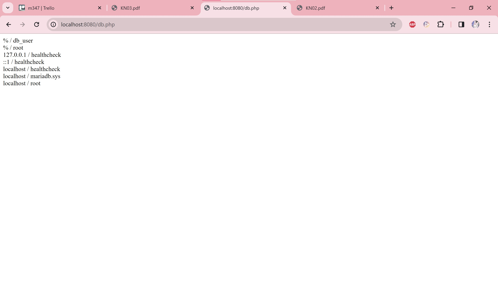

# Dockerfile

### A

docker build -t emotionalsupport/m347:kn02a .

docker pull -t emotionalsupport/m347:kn02a .

docker login
W
docker push emotionalsupport/m347:kn02a

starts a Container: `docker run -p 8080:80 --name kn02a-container emotionalsupport/m347:kn02a

http://localhost:8080

### B

docker build -t emotionalsupport/kn02b-db:latest -f dockerfile-db .

docker build -t emotionalsupport/kn02b-web:latest -f dockerfile-wc .

docker run -d --name kn02b-db -p 3306:3306 emotionalsupport/kn02b-db:latest

docker run -d --name kn02b-web -p 8080:80 --link kn02b-db emotionalsupport/kn02b-web:latest

