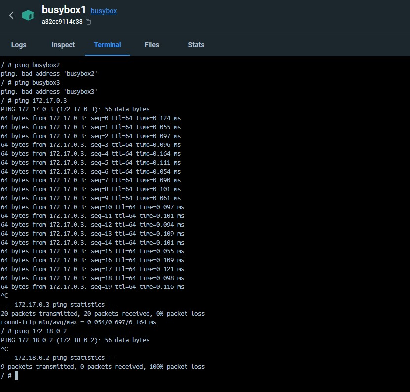
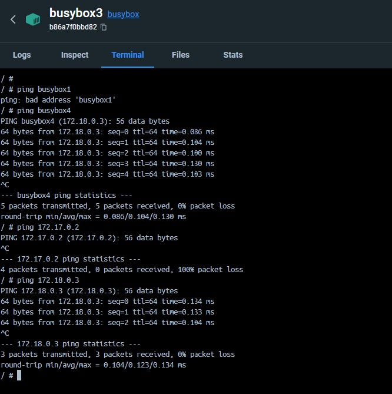

# Netzwerk und Sicherheit

### A

docker network create -d bridge tbz

docker run -it -d --name=busybox1 busybox

docker run -it -d --name=busybox2 busybox

docker run -it -d --network=tbz --name=busybox3 busybox

docker run -it -d --network=tbz --name=busybox4 busybox

docker inspect busybox1 busybox2 busybox3 busybox4

(ip network is under "NetworkSettings")

busybox1: 172.17.0.2
busybox2: 172.17.0.3
busybox3: 172.18.0.2
busybox4: 172.18.0.3

Busybox-1 Default Gateway: 172.17.0.1

Busybox-3 Default Gateway: 172.18.0.1

The difference is that with the default bridge network, containers are connected partially, only through the IP address, which can change over time. However, when I create my own network, I can use container names that do not change over time.

In KN02, the containers were in the same gateway, but they couldn't communicate through the container name. With the link, I associate the name with the IP address, allowing the container to communicate.
