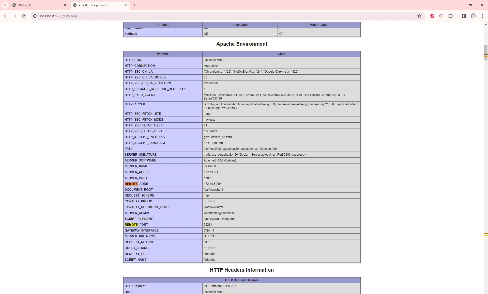
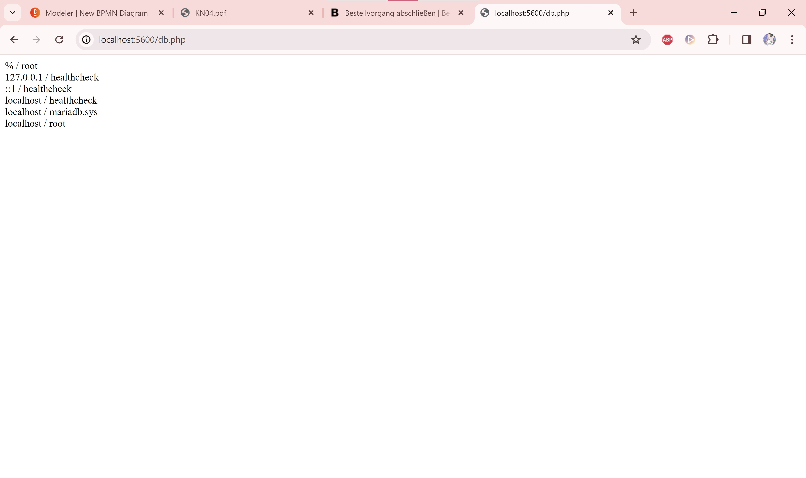
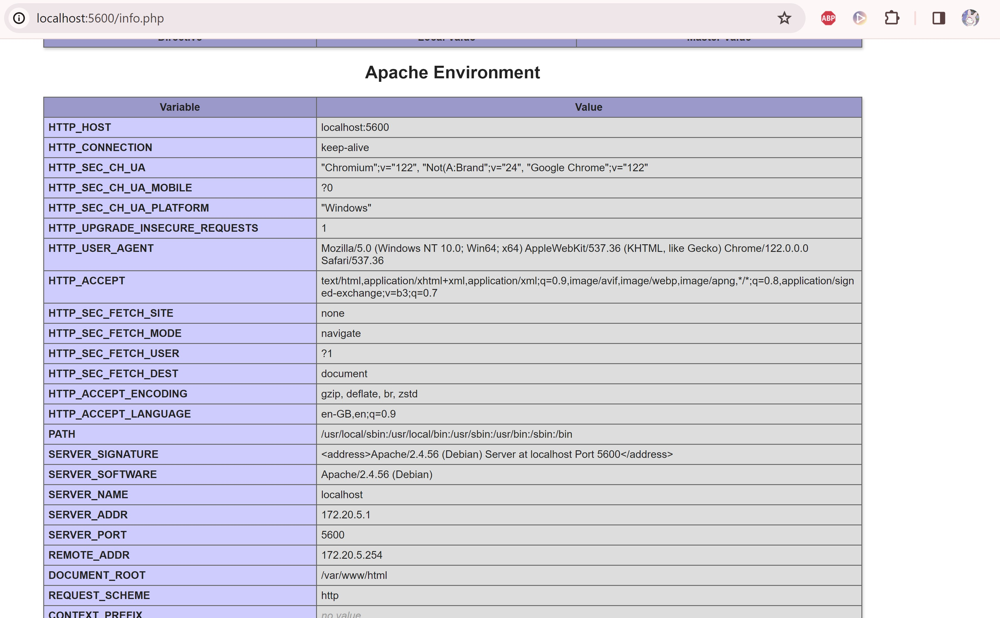
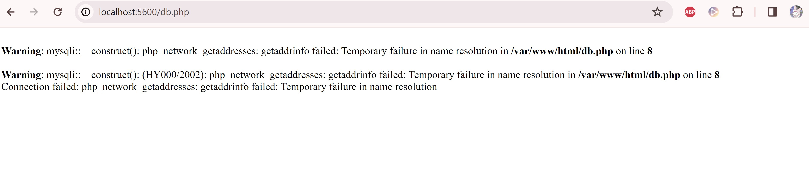
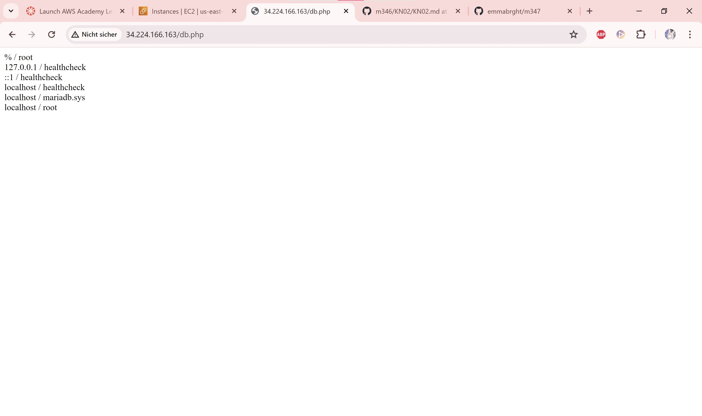
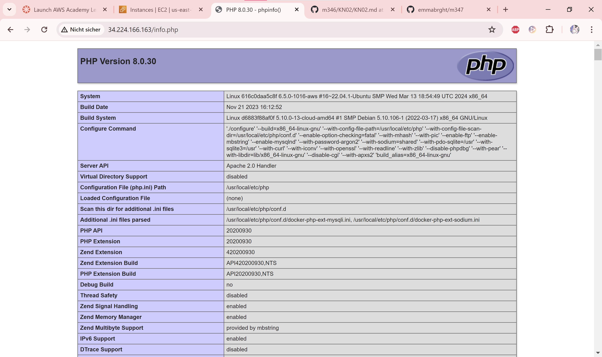

# Docker compose

### A

#### a

docker build -t m347-kn04a-web -f dockerfile .

docker-compose up

Docker compose up will build, create, connect and start all objects defined in the docker-compose.yml file. (in my case, the 2 containers and the kn04 network)

#### b

The error occurs because the database login values are hard coded, which in this case means, we cannot connect. To go around this, variables could be declared in the docker compose file and we would ues them in db.php with the system enviroment variables.

### B

