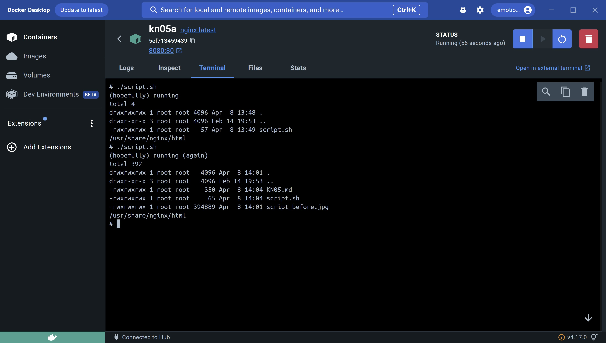
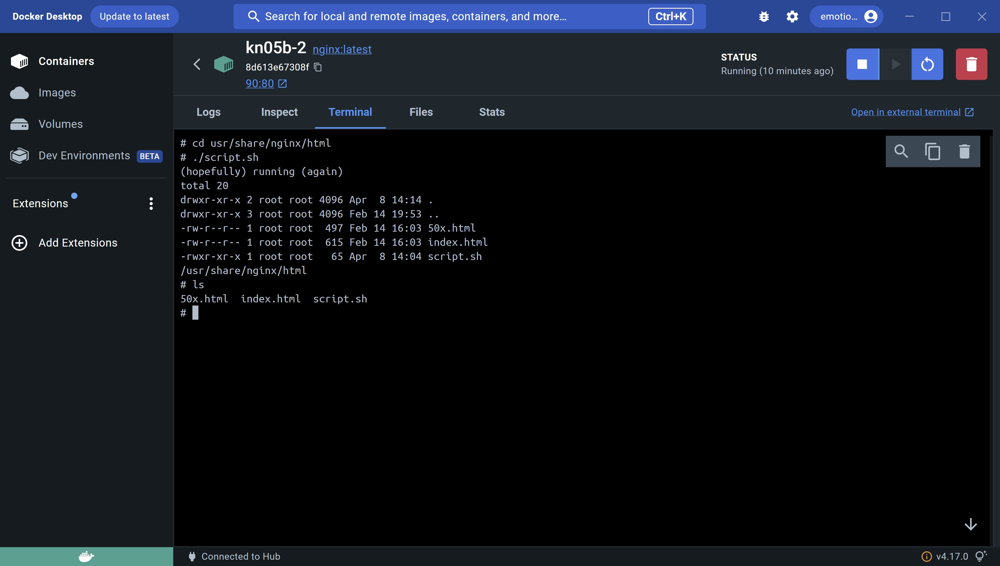
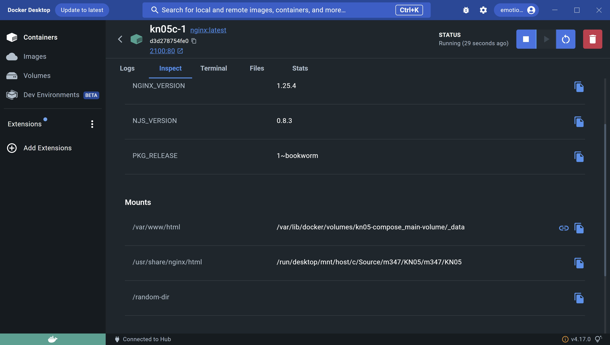
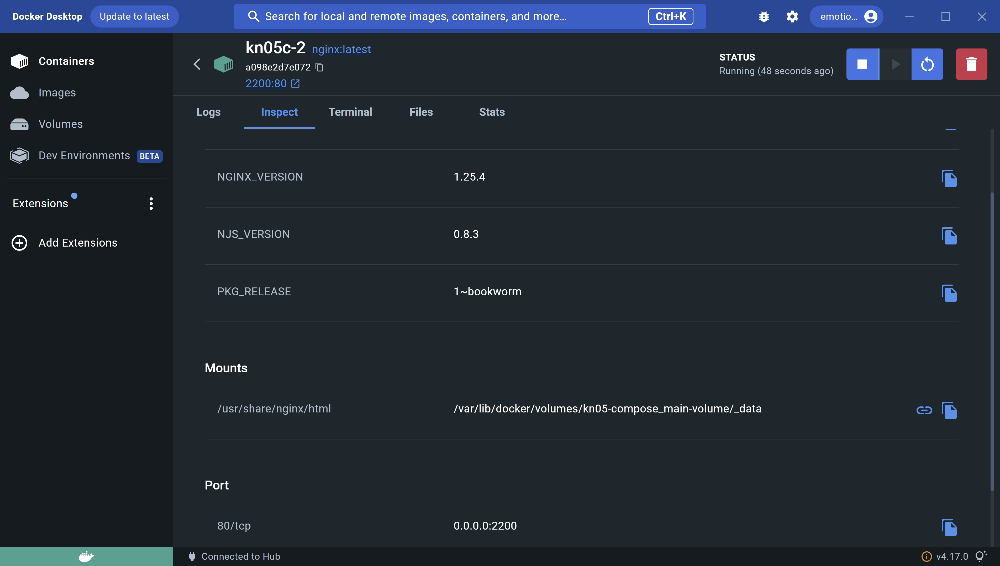

# Bind mounting

### A

(if this is wrong please ignore this)
good to know: -v is like a more complicated version of --mount. -v requires 3 parameters: the first being the path to your script on your device, the second is the path to where the script should be stored, the third is the permissions of the script.

docker run --name kn05a -p 8080:80 -v C:/Source/m347/KN05:/usr/share/nginx/html:rw -d nginx:latest

### B

docker volume create kn05-volume

docker run --name kn05b-1 -p 80:80 -v kn05-volume:/usr/share/nginx/html:rw -d nginx:latest

docker run --name kn05b-2 -p 90:80 -v kn05-volume:/usr/share/nginx/html:rw -d nginx:latest

### C

