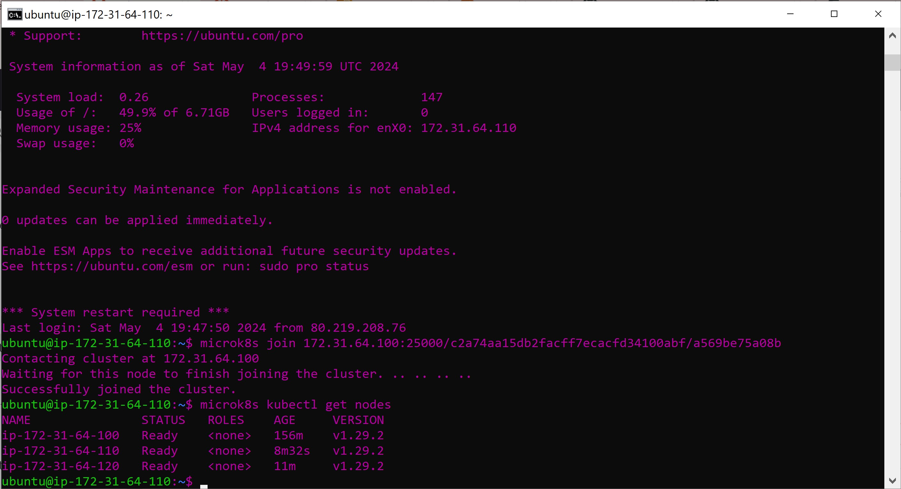

## A

## B

It describes the status of Kubernetes, showing what is connected and what roles are assigned. It also shows what addons have been added.

In regards to High Availability, it means that an instance in Kubernetes should continue running even if one of the instances goes down.

Because the worker node isnt functioning on the "control plane", it can't call up the status

For the same reason specified above, it would need to function on the "control plane".

MicroK8s allows you to manage a singular node in your cluster. With microk8s kubectl you can manage the entire cluster in which your nodes are stored.
