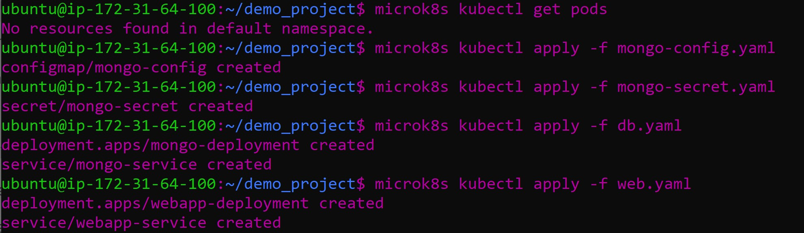
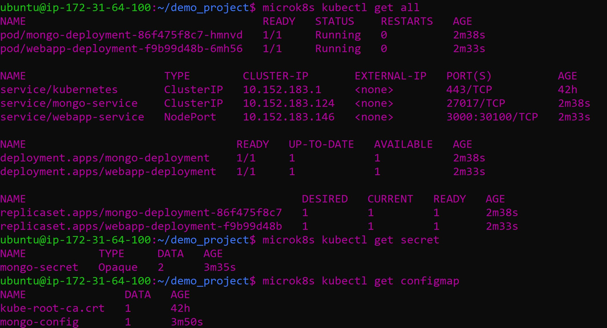
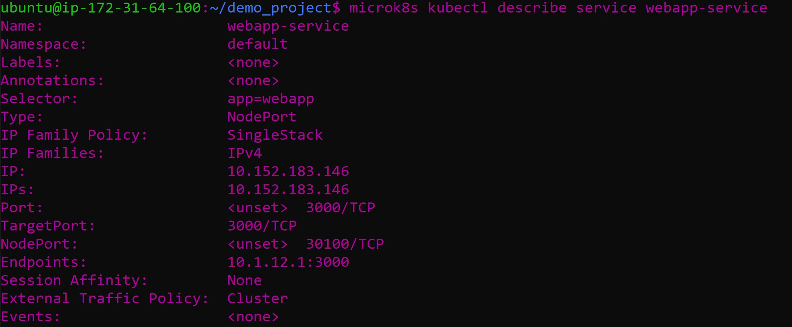
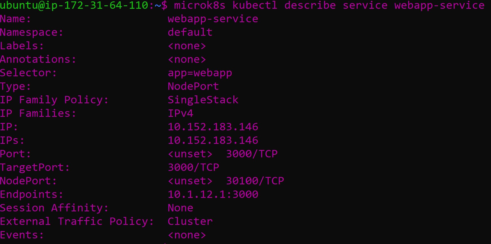
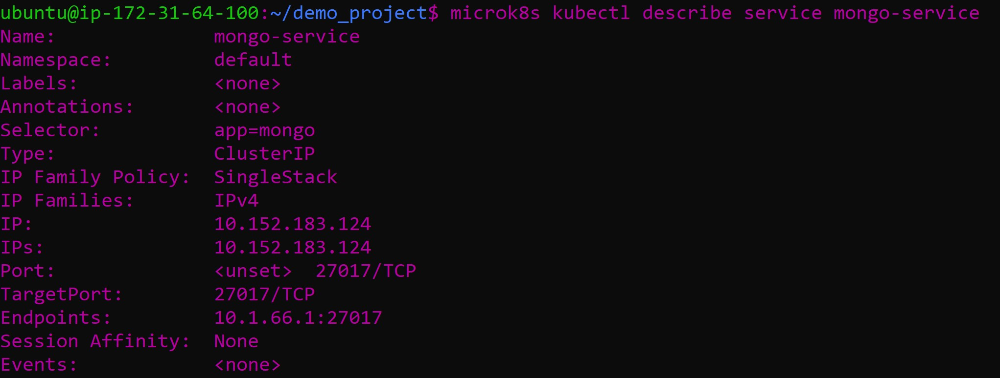
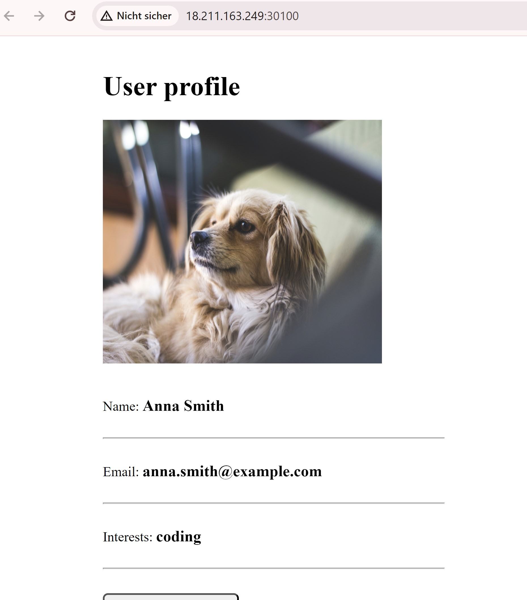
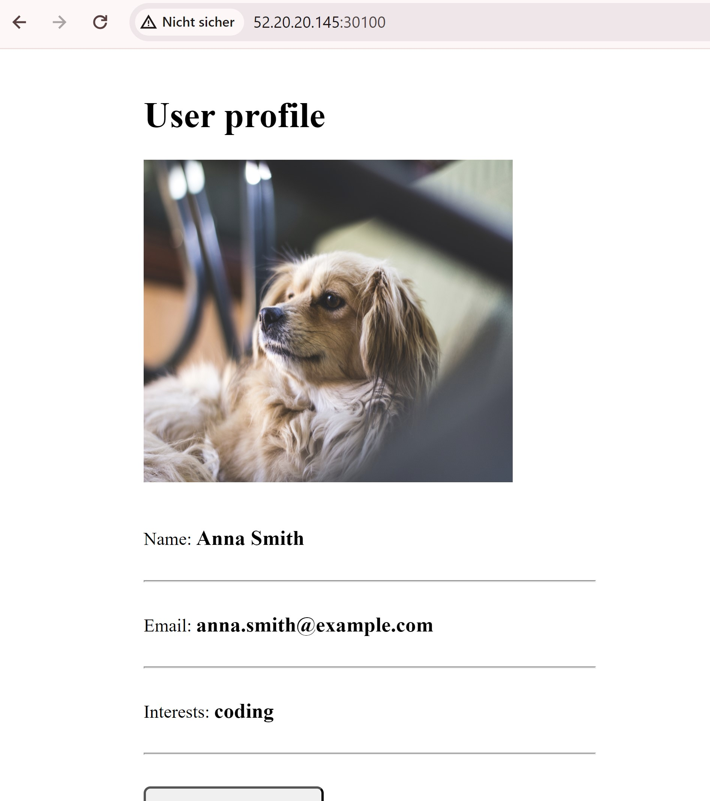
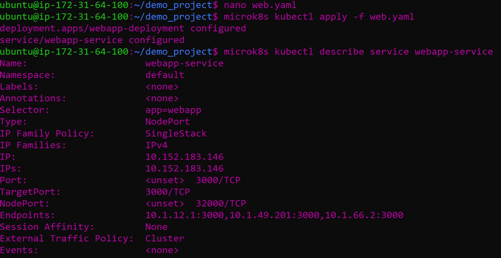
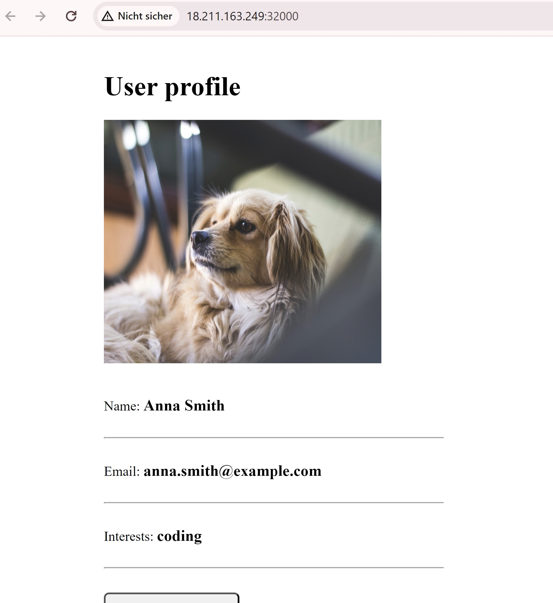

## A

### Difference between Pods and

A pod is the smallest executable unit in Kubernetes. It can contain one or more containers that run together on a cluster. A Replica ensures the availablility of identical pods (which are executed simultaineously).

The pods themselves are the application and Replicas ensure that the application stays running through enough pods running.

### Difference between Service and Deployment

A Service serves as a sort of "set address" for a group of pods in kubernetis. It ensures communication throughout the entire application and the pods without having to worry about the locations. Deployment on the other hand, defines how the Pods should be managed (crud) in kubernetes. All of this can then be done while the application is still running.

### Ingress

Without Ingress, the services in a cluster would need their own public addresses and ports as ingress can serve as a gateway for traffic for outside object interacting with the kubernetes cluster.

### Statefulset

It helps to manage applications that need to remember specific. Unlike applications that don't require persistent data and can be easily duplicated, stateful applications need to store certain data that is stable and persistent.

An example (outside of databases) would be a messaging system. A StatefulSet can be used to deploy and manage messaging nodes in a Kubernetes cluster, ensuring that each node has its own identity, stable storage, and can maintain its data even if it's restarted or moved to a different node.

## B

The difference is in the deployment and service. In Part B they are combined them into one file. Though they can also be seperate.

#### MongoURL

The specified MongoURL in the mongo-config.yaml was correct, as we used the defined name in the mongo-service. Therefore, the name in the mongo-service points to the MongoDB.

The difference is that instead of displaying the detailed information of the webapp-service here, the information of the database is shown.

#### Website

By adding port 30100 to the inbound rules of my security group, I was able to access the page.

#### MongoDB Compass

The connection to the database will not work because the port from AWS was not exposed. Additionally, in our Kubernetes configuration, we did not expose the port either. To fix this, we need to expose the ports in our DB YAML file and in AWS.

It has three endpoints instead of just one.
